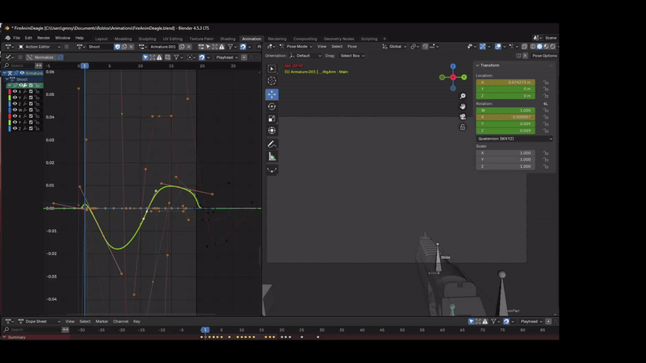
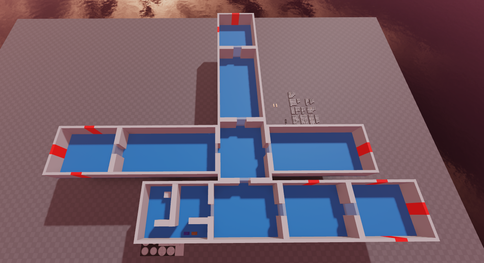
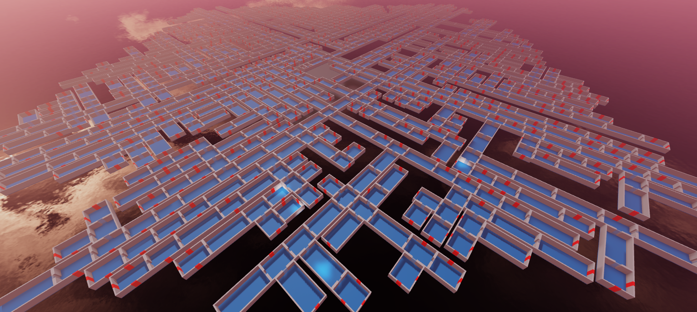

# RL game framework

## Modular real-time game framework with an integrated RL system used to implement smart enemies that can evaluate their decisions based on player's behaviours. 

## These agents learn during live gameplay while also considering real-time constraints and performance.

-- things to showcase
Map Generation Module
Weapon Animations done
Damage system done
Camera sway motion done
Sprint system done
Loadout system done
Visor GUI done
Inventory item dragging system done

